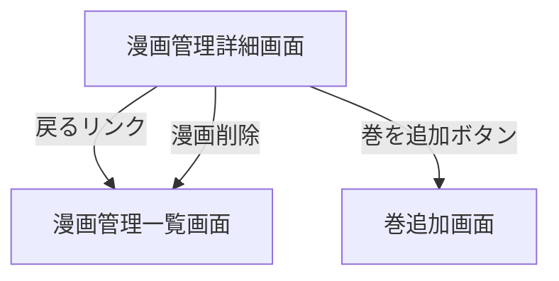

# 漫画管理詳細画面

## 画面概要

選択した漫画の詳細情報を表示・編集・削除する管理画面。タイトルの編集と巻一覧の確認、漫画の削除ができる。

---

## 画面構成

### 入力項目

| 項目名             | 説明                       | 制約                     |
| ------------------ | -------------------------- | ------------------------ |
| タイトル（編集時） | 漫画タイトルの入力フィールド | 空文字不可、重複不可、禁止文字不可 |

### 出力項目

| 項目名         | 説明                                   | 表示条件                 |
| -------------- | -------------------------------------- | ------------------------ |
| 戻るリンク     | 漫画管理一覧画面へ戻るリンク           | 常に表示                 |
| 漫画タイトル   | 漫画名を見出しとして表示               | 常に表示                 |
| 編集ボタン     | タイトルをインライン編集モードにする   | 非編集時に表示           |
| 保存ボタン     | 編集したタイトルを保存する             | 編集時に表示             |
| キャンセルボタン | 編集をキャンセルして元のタイトルに戻す | 編集時に表示             |
| 巻一覧         | 「第N巻」形式で巻を一覧表示           | 巻が1件以上存在する場合   |
| 巻を追加ボタン | 巻追加画面へ遷移する                   | 常に表示                 |
| 削除ボタン     | 漫画をDBから削除する                   | 常に表示                 |

### 動作仕様

- 漫画管理一覧画面から漫画名をクリックして遷移する
- 存在しないIDを指定した場合はエラー画面を表示する
- 巻が0件でも画面は表示する（ユーザー向け詳細とは異なる）
- タイトル編集はインライン方式で行う
  1. 「編集」ボタンをクリックするとタイトルがinput欄に切り替わる
  2. 「保存」ボタンで更新、「キャンセル」ボタンで元に戻る
  3. 空文字での保存はバリデーションエラーとする
  4. 他の漫画と同じタイトルへの変更はエラーとする
  5. ファイル名に使用できない文字（`\ / : * ? " < > |`）を含む場合はエラーとする
  6. タイトル変更時は対応する画像フォルダ名も同期してリネームされる
- 巻一覧は巻番号の昇順で表示する
- 漫画の削除
  1. 「漫画を削除」ボタンをクリックすると確認ダイアログを表示する
  2. 確認後、DBからレコードを削除する（関連する巻もCASCADEで削除される）
  3. 画像フォルダは削除しない
  4. 削除後は漫画管理一覧画面にリダイレクトする

---

## 画面遷移

---
