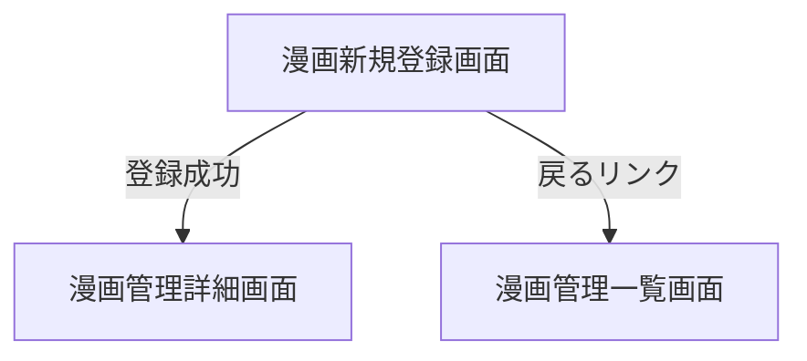

# 漫画新規登録画面

## 画面概要

新しい漫画を登録する画面。「新規作成」と「既存フォルダ」の2つの登録モードをタブで切り替えられる。

- **新規作成**: タイトルを入力して登録する。データフォルダも新たに作成される
- **既存フォルダ**: データフォルダに既にある漫画フォルダを選択して登録する。フォルダ名がタイトルとなり、巻フォルダ（3桁ゼロ埋め形式）も自動検出して一括登録する

---

## 画面構成

### 入力項目

| 項目名               | タイプ         | 必須 | 制約       | 初期値 | モード       |
| -------------------- | -------------- | ---- | ---------- | ------ | ------------ |
| タイトル             | テキスト       | ○    | 空文字不可、禁止文字不可 | 空     | 新規作成     |
| フォルダ選択         | リスト選択     | ○    | -          | 未選択 | 既存フォルダ |

- 「既存フォルダ」モードでは未登録のフォルダのみ一覧に表示する

### 出力項目

| 項目名                   | 説明                                   | 表示条件                                     |
| ------------------------ | -------------------------------------- | -------------------------------------------- |
| 戻るリンク               | 漫画管理一覧画面へ戻るリンク           | 常に表示                                     |
| モード切り替えタブ       | 「新規作成」「既存フォルダ」を切り替え | 常に表示                                     |
| 未登録フォルダ一覧       | 選択可能なフォルダ名のリスト           | 既存フォルダモード時                         |
| フォルダなしメッセージ   | 「登録可能なフォルダがありません」     | 既存フォルダモードでフォルダが0件の場合       |
| 検出された巻一覧         | 「第N巻」形式で巻を一覧表示           | フォルダ選択後、巻が1件以上検出された場合     |
| 巻なしメッセージ         | 「巻フォルダが見つかりません」         | フォルダ選択後、巻が0件の場合                 |
| 登録ボタン               | 登録処理を実行する                     | 常に表示                                     |
| エラーメッセージ         | バリデーションエラーの内容             | バリデーション失敗時のみ                     |

### 動作仕様

#### 新規作成モード

1. タイトルを入力して「登録」ボタンを押す
2. 登録成功時、漫画管理詳細画面へ遷移する

#### 既存フォルダモード

1. フォルダ一覧から登録したいフォルダを選択する
2. 選択すると検出された巻が表示される
3. 内容を確認し「登録」ボタンを押す
4. 登録成功時、漫画とあわせて検出された巻も登録され、漫画管理詳細画面へ遷移する

#### バリデーション

| 条件           | メッセージ                         | モード       |
| -------------- | ---------------------------------- | ------------ |
| タイトル未入力 | タイトルを入力してください         | 新規作成     |
| タイトル重複   | 同じタイトルの漫画が既に存在します | 両方         |
| 禁止文字使用   | タイトルに使用できない文字が含まれています: `\ / : * ? " < > \|` | 新規作成 |
| フォルダ未選択 | フォルダを選択してください         | 既存フォルダ |

---

## 画面遷移

---
