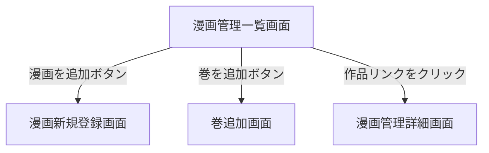

# 漫画管理一覧画面

## 画面概要

登録されている全漫画の一覧を表示する管理画面。漫画の新規登録画面・巻追加画面への導線を持つ。

---

## 画面構成

### 入力項目

なし

### 出力項目

| 項目名             | 説明                                   | 表示条件                 |
| ------------------ | -------------------------------------- | ------------------------ |
| 画面タイトル       | 「漫画管理」                           | 常に表示                 |
| 漫画を追加ボタン   | 漫画新規登録画面へのリンク             | 常に表示                 |
| 巻を追加ボタン     | 巻追加画面へのリンク                   | 常に表示                 |
| 作品リンク         | 作品タイトルのクリック可能なリンク      | 作品が1件以上存在する場合 |

- 「漫画を追加」ボタンをクリックすると、漫画新規登録画面へ遷移する
- 「巻を追加」ボタンをクリックすると、巻追加画面へ遷移する
- 作品リンクをクリックすると、その作品の管理詳細画面へ遷移する
- ユーザー向け一覧とは異なり、巻が0件の漫画も表示する

---

## 画面遷移

---
