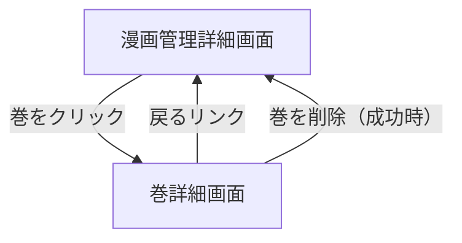

# 巻詳細画面

## 画面概要

選択した巻のページ画像をエクスプローラー風のサムネイルグリッドでプレビューできる画面。サムネイルをクリックすると拡大表示のモーダルが開く。巻の削除も可能（画像フォルダは削除しない）。

---

## 画面構成

### 入力項目

なし

### 出力項目

| 項目名                 | 説明                                         | 表示条件           |
| ---------------------- | -------------------------------------------- | ------------------ |
| 戻るリンク             | 漫画管理詳細画面へ戻るリンク                 | 常に表示           |
| 漫画タイトル           | 対象漫画のタイトル                           | 常に表示           |
| 巻番号                 | 対象巻の巻番号（例: 第3巻）                  | 常に表示           |
| ページ数               | 巻に含まれる画像ファイル数                   | 常に表示           |
| サムネイルグリッド     | ページ画像のサムネイル一覧（4列レスポンシブ）| 常に表示           |
| ファイル番号           | 各サムネイル下にページ番号を表示（例: 0001） | 常に表示           |
| 巻を削除ボタン         | 巻のDBレコードを削除する                     | 常に表示           |

### 動作仕様

1. 漫画管理詳細画面の巻リストから対象巻をクリックして遷移する
2. ページ画像がサムネイルグリッドで一覧表示される
3. サムネイルをクリックすると拡大モーダルが開く
   - 拡大画像を中央に表示
   - 左右矢印ボタンまたはキーボード（←→キー）でページ送り
   - ESCキーまたは✕ボタンでモーダルを閉じる
   - 現在のページ番号と総ページ数を表示（例: 3 / 24）
4. 「巻を削除」ボタンを押すと確認ダイアログが表示される
5. 削除確認後、DBレコードのみ削除する（画像フォルダ・ファイルは削除しない）
6. 削除成功時、漫画管理詳細画面へ遷移する

---

## 画面遷移

---
