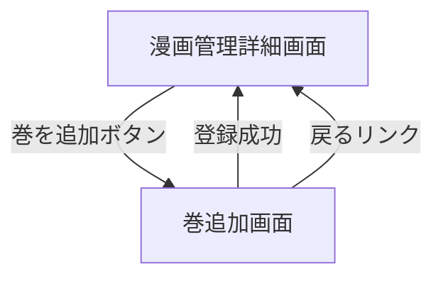

# 巻追加画面

## 画面概要

選択した漫画に新しい巻を追加する画面。巻番号を指定し、ソースフォルダ（`COMIC_DATA_DIR/work` 内のサブフォルダ）を選択して登録する。ソースフォルダ内の画像ファイルは0埋め4桁のファイル名にリネームされて巻フォルダにコピーされる。

---

## 画面構成

### 入力項目

| 項目名             | タイプ         | 必須 | 制約                                 | 初期値     |
| ------------------ | -------------- | ---- | ------------------------------------ | ---------- |
| 巻番号             | 数値入力       | ○    | 1以上の整数、既存巻番号と重複不可    | 最新巻+1   |
| ソースフォルダ     | リスト選択     | ○    | 対象画像が1件以上含まれること        | 未選択     |

- 巻番号のデフォルト値は、対象漫画の登録済み巻のうち最大の巻番号+1とする。巻が0件の場合は1とする
- ソースフォルダは `COMIC_DATA_DIR/work` 内のサブフォルダを一覧表示する
- 対象拡張子: `.jpg`, `.jpeg`, `.png`, `.webp`
- 対象外のファイル（上記以外の拡張子）はスキップする
- 対象画像ファイルはファイル名昇順でソートし、0001から連番でリネームしてコピーする（元の拡張子は保持）
  - 例: `page_a.png` → `0001.png`, `scan02.jpg` → `0002.jpg`

### 出力項目

| 項目名                   | 説明                                         | 表示条件                                 |
| ------------------------ | -------------------------------------------- | ---------------------------------------- |
| 戻るリンク               | 漫画管理詳細画面へ戻るリンク                 | 常に表示                                 |
| 漫画タイトル             | 対象漫画のタイトルを表示                     | 常に表示                                 |
| ソースフォルダ一覧       | 選択可能なフォルダ名のリスト                 | 常に表示                                 |
| フォルダなしメッセージ   | 「利用可能なフォルダがありません」           | フォルダが0件の場合                       |
| 登録ボタン               | 登録処理を実行する                           | 常に表示                                 |
| エラーメッセージ         | バリデーションエラーの内容                   | バリデーション失敗時のみ                 |

### 動作仕様

1. 漫画管理詳細画面から「巻を追加」ボタンをクリックして遷移する
2. 巻番号を確認・変更する（デフォルトは最新巻+1）
3. ソースフォルダ一覧からフォルダを選択する
4. 「登録」ボタンを押す
5. 登録処理:
   - DBに巻レコードを作成する
   - 巻フォルダ（3桁ゼロ埋め形式）を作成する（例: `comicTitle/003/`）
   - ソースフォルダ内の画像ファイルをファイル名昇順でソートし、0埋め4桁の連番にリネームして巻フォルダにコピーする
6. 登録成功時、漫画管理詳細画面へ遷移する

#### バリデーション

| 条件               | メッセージ                               |
| ------------------ | ---------------------------------------- |
| 巻番号が未入力     | 巻番号を入力してください                 |
| 巻番号が1未満      | 巻番号は1以上を指定してください           |
| 巻番号が整数でない | 巻番号は整数で入力してください           |
| 巻番号が重複       | 第N巻は既に登録されています               |
| フォルダ未選択     | ソースフォルダを選択してください         |
| 対象画像が0件      | 対象の画像ファイルが見つかりません（対象拡張子: jpg, jpeg, png, webp） |

---

## 画面遷移

---
