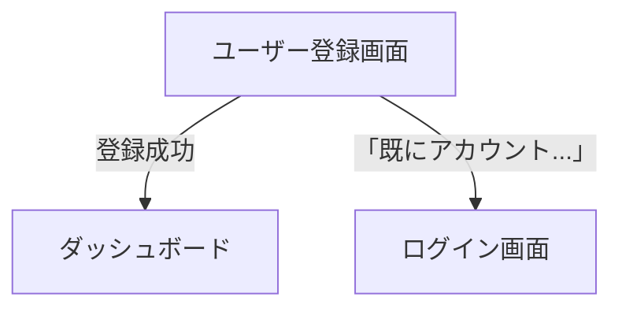

# ユーザー登録画面

## 画面概要

新規ユーザーがアカウントを作成する画面

---

## 画面構成

### 入力項目

| 項目名             | タイプ           | 必須 | 制約                    | 初期値       |
| ------------------ | ---------------- | ---- | ----------------------- | ------------ |
| メールアドレス     | テキスト         | ○    | メール形式、255文字以内 | 空           |
| パスワード         | パスワード       | ○    | 12文字以上、英数字含む  | 空           |
| パスワード（確認） | パスワード       | ○    | パスワードと一致        | 空           |
| 通知受信           | チェックボックス | -    | -                       | チェック済み |

- 補足内容トでチェック済み（マーケ要望、オプトアウト方式）

### 出力項目

| 項目名                               | 説明                   | 表示条件                                   |
| ------------------------------------ | ---------------------- | ------------------------------------------ |
| エラーメッセージ                     | 登録失敗時のエラー内容 | 登録失敗時のみ                             |
| 「登録する」ボタン                   | 登録処理を実行         | 常に表示（全項目バリデーション通過で活性） |
| 「既にアカウントをお持ちの方」リンク | ログイン画面へ遷移     | 常に表示                                   |

- エラーメッセージは対象項目の近くに表示する

---

## 画面遷移

