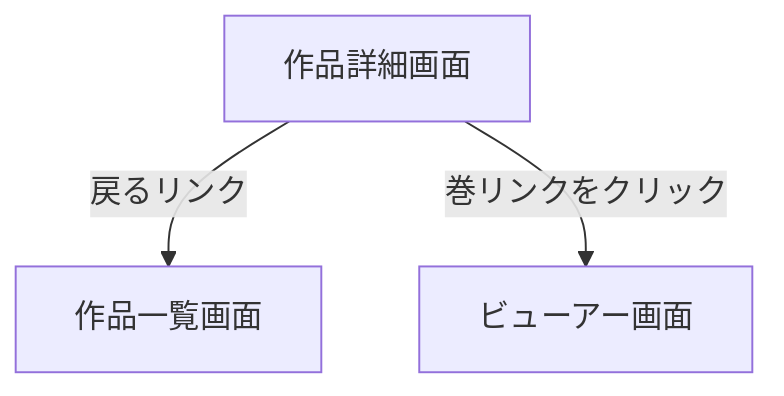

# 作品詳細画面

## 画面概要

選択した作品の巻一覧を表示する画面。

---

## 画面構成

### 入力項目

なし

### 出力項目

| 項目名       | 説明                                | 表示条件                 |
| ------------ | ----------------------------------- | ------------------------ |
| 作品タイトル | 作品名を見出しとして表示            | 常に表示                 |
| 戻るリンク   | 作品一覧画面へ戻るリンク            | 常に表示                 |
| 巻リンク     | 「第N巻」形式のクリック可能なリンク  | 巻が1件以上存在する場合   |

- 巻リンクは巻番号の昇順で表示する
- 巻にタイトルはなく、番号のみで表示する
- 巻リンクをクリックすると、その巻のビューアー画面へ遷移する
- 存在しない作品、または巻が0件の作品を指定した場合は、エラー画面を表示する

---

## 画面遷移

---
