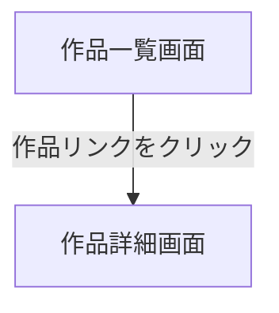

# 作品一覧画面

## 画面概要

登録されている漫画作品の一覧を表示する画面。アプリケーションのトップページ。

---

## 画面構成

### 入力項目

| 項目名             | タイプ       | 必須 | 制約           | 初期値 |
| ------------------ | ------------ | ---- | -------------- | ------ |
| タイトル絞り込み   | テキスト入力 | ×    | 部分一致検索   | 空文字 |

- テキスト入力に文字を入力すると、タイトルが部分一致する作品のみ表示される
- 検索ボタンはなく、入力内容の変更に応じてリアルタイムに絞り込まれる
- 大文字・小文字を区別しない

### 出力項目

| 項目名       | 説明                               | 表示条件                 |
| ------------ | ---------------------------------- | ------------------------ |
| 画面タイトル | 「漫画一覧」                       | 常に表示                 |
| 作品リンク   | 作品タイトルのクリック可能なリンク  | 作品が1件以上存在する場合 |

- 作品リンクをクリックすると、その作品の詳細画面へ遷移する

---

## 画面遷移

---
