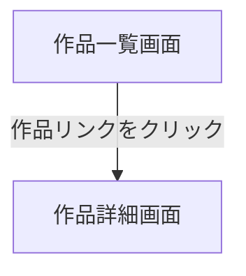

# 作品一覧画面

## 画面概要

登録されている漫画作品の一覧を表示する画面。アプリケーションのトップページ。

---

## 画面構成

### 入力項目

なし

### 出力項目

| 項目名       | 説明                               | 表示条件                 |
| ------------ | ---------------------------------- | ------------------------ |
| 画面タイトル | 「漫画一覧」                       | 常に表示                 |
| 作品リンク   | 作品タイトルのクリック可能なリンク  | 作品が1件以上存在する場合 |

- 作品リンクをクリックすると、その作品の詳細画面へ遷移する

---

## 画面遷移

---
