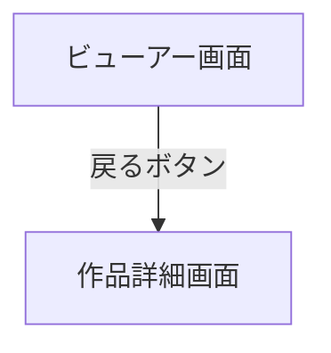

# ビューアー画面

## 画面概要

指定した作品・巻のページ画像を縦スクロールで閲覧する画面。

---

## 画面構成

### 入力項目

なし

### 出力項目

| 項目名               | 説明                                     | 表示条件                               |
| -------------------- | ---------------------------------------- | -------------------------------------- |
| ヘッダー             | 作品タイトル・巻番号を表示（スクロール固定） | 常に表示                               |
| 戻るボタン           | 作品詳細画面へ戻るボタン                 | 常に表示                               |
| ページ画像           | 漫画ページを縦方向に順番に表示           | ページが1件以上存在する場合             |
| ページなしメッセージ | 「ページが見つかりません」               | ページが0件の場合                       |

- ヘッダーはスクロールしても画面上部に固定表示される
- ページ画像はスクロールに応じて遅延読み込みされる
- ページの並び順はファイル名の昇順で決定される
- 対応画像形式: JPG, PNG, WebP
- 存在しない作品・巻を指定した場合は、エラー画面を表示する

---

## 画面遷移

---
